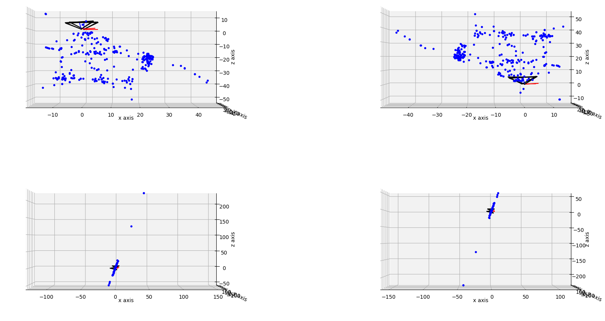
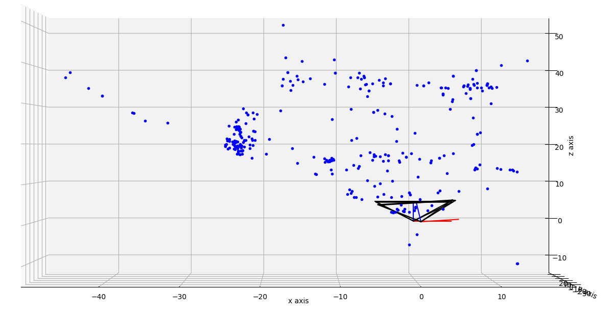
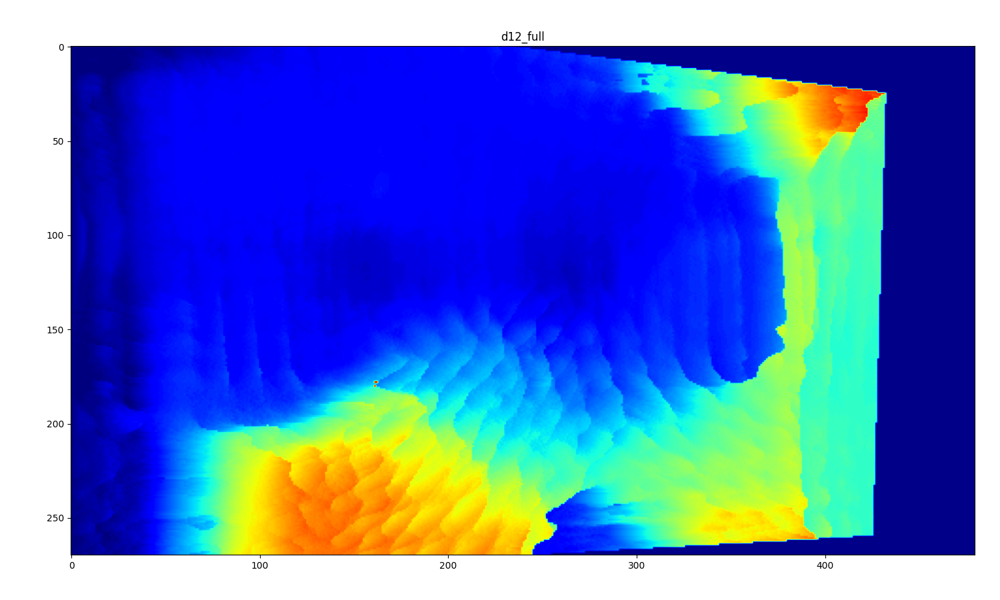

# image-epipolar-geometry

## description
- Calculating disparity (and thus depth of the scene) using two (stereo) images of a scene.
- Sort of what eyes do all the time.

## roadmap
Problems in `hw5.pdf` are solved.

## code
- All source code is in `Stereo_Reconstruction.py`.
- It reads from `left.bmp` and `right.bmp`.

## documentation
- Code is the documentation of itself.

## usage
- Use `python3 Stereo_Reconstruction.py` to generate a disparity map.
- A summary of the pipeline is given in `report.pdf`.

## demonstration
The pipeline is demonstrated below.

- SIFT matches.

| left-to-right | right-to-left |
| --- | --- |
|  |  |

- SIFT matches after nearest neighbour filtering.

| left-to-right | right-to-left |
| --- | --- |
|  |  |

- Bi-directional SIFT matches.

- Epipolar lines.

- Triangulated points with possible camera poses.

- Triangulated points with disambiguated camera pose.

- Rectified images.

- Disparity map.

- Disparity map vs SIFT size.

- Disparity map over rectified left image vs SIFT size.

